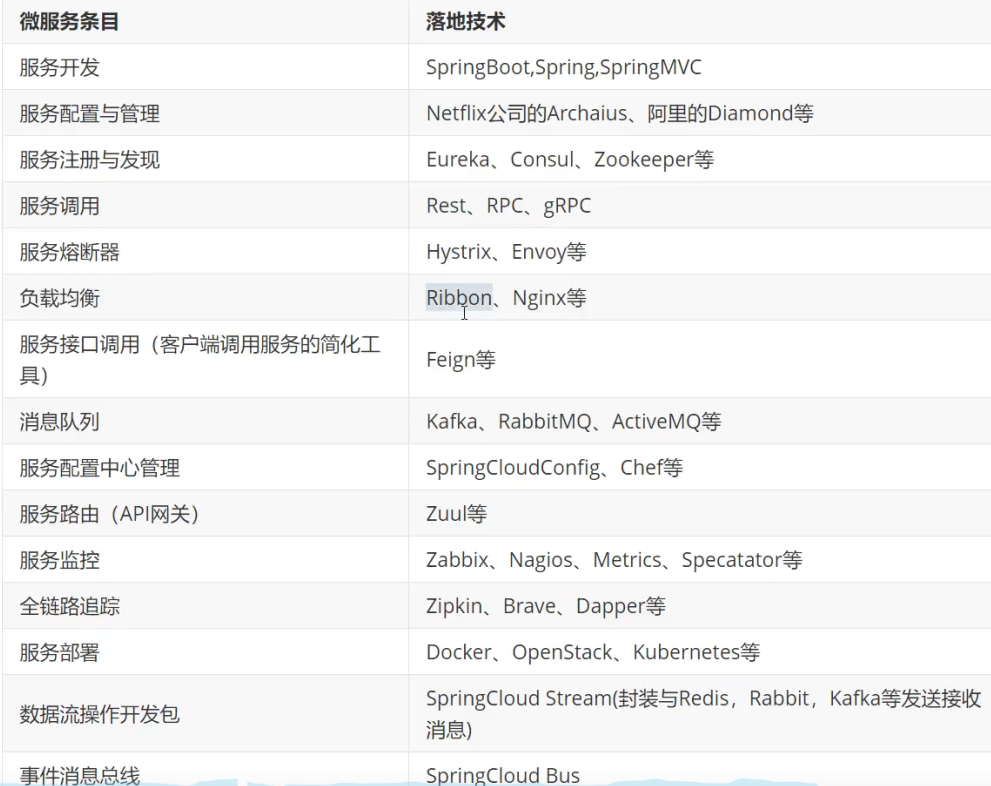
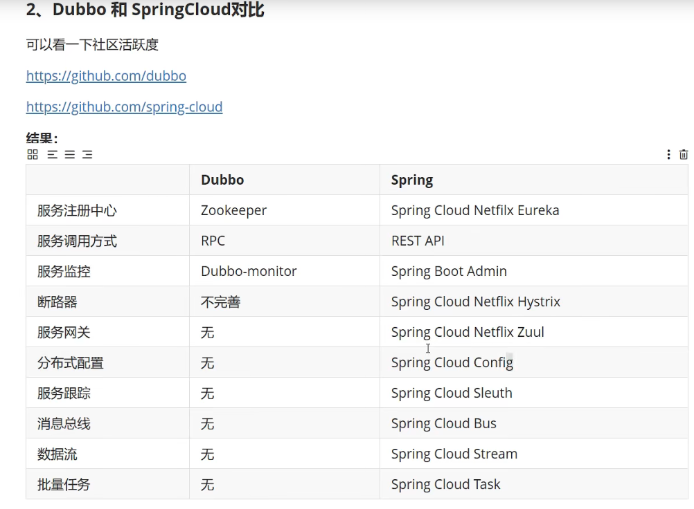

## SpringCloud和SpringBoot关系
-  SpirngBoot专注于快速方便的开发单个个体微服务
-  SpringClound是关注全局的微服务协调整理治理框架，它将SpringBoot开发的一个个单个微服务整合并管理起来，为各个微服务之间提供：配置管理，服务发现，断路器，路由，微代理，事件总线，全局锁，决策竞选，分布式会话等等集成服务。
-  SpringBoot可以离开SpringCloud独立使用，开发项目，但是SpringCloud离不开SpringBoot，属于依赖关系
-  SpringBoot专注于快速，方便的开发单个个体微服务，SpringCloud关注全局的服务治理框架

## 微服务架构4个核心问题
 1. 服务很多，客户端该怎么访问？
 2. 服务很多，服务之间如何通信？
 3. 服务很多，如何治理？
 4. 服务挂了怎么办？

## springcloud 生态 
springcloud可以解决上面-微服务架构4个核心问题

市面上存在的3套解决方案：
1. Spring Cloud NetFlix 一站式解决方案

   api网关，zuul组件
   
   Feign ---HttpClient--- Http通信方式，同步，阻塞
   
   服务注册发现：Eureka
   
   熔断机制：Hystrix
   
2. Apache Dubbo Zookeeper 半自动，需要整个别人的(Dubbo 这个方案并不完善~)

    API：没有，找第三方组件，或者自己实现
    
    Dubbo
    
    服务注册发现：Zookeeper
    
    没有：借助 Hystrix
    
3. Spring Cloud Alibaba 一站式解决方案，更简单

4. 新概念：服务网格 Server Mesh

## ACID原则
 - A(Atomicity) 原子性
 - C(Consistency) 一致性
 - I(Isolation) 隔离性
 - D(Durbility) 持久性
 
 RDBMS(Mysql、Oracle、sqlServer)  ===> ACID
 
## CAP原则
 - C(Consistency) 强一致性
 - A(Availability) 可用性
 - P(Partition tolerance) 分区容错性
 
CAP 原则指的是，这三个要素最多只能同时实现两点，不可能三者兼顾。
 - CA:单点集群，满足一致性，可用性系统，通常可扩展性较差
 - CP:满足一致性，分区容错性的系统，通常性能不是特别高
 - AP:满足可用性，分区容错性的系统，通常可能对一致性要求低一些
 
 NoSQL(redis、mongdb)  ===> CAP
 
## Eureka 
- 服务注册与发现
- 在服务注册后，Eureka Client会维护一个心跳来持续通知Eureka Server，说明服务一直处于可用状态，防止被剔除。默认每隔30秒eureka.instance.lease-renewal-interval-in-seconds 发送一次心跳来进行服务续约
- 集群配置
- Eureka AP原则  (如果连接失败了，会自动切换到其它节点，只不过查到的信息可能不是最新的。如果在15分钟内超过85%的节点都没有正常心跳，Eureka就认为客户端与注册中心出现了网络故障，此时会出现一下情况：1.Eureka不再从注册列表中移除因为长时间没收到心跳而应该过期的服务2.Eureka仍然能够接受新服务的注册和查询请求，但是不会被同步到其它节点上3.当网络稳定时，当前实例新的注册信息会被同步到其它节点中)
- Zookeeper CP原则  (如果master节点挂了，剩余节点会重新进行leader选举，选举期间整个集群不可用，由于选举时间太长（30~120s），所以无法容忍)

 对比Zookeeper结论：Eureka可以很好的应对网络故障导致部分节点失去联系的情况，而不会像Zookeeper那样使整个注册服务瘫痪
 
## Nacos
 nacos 使用教程：[点击链接访问](https://nacos.io/zh-cn/docs/quick-start-spring-cloud.html)
 Nacos与Eureka自我保护机制对比: 
 
 相同点：保护阈值都是个比例，0-1 范围，表示健康的 instance 占全部instance 的比例。
 
 不同点：
 
 1. 保护方式不同
    Eureka保护方式：当在短时间内，统计续约失败的比例，如果达到一定阈值，则会触发自我保护的机制，在该机制下，Eureka Server不会剔除任何的微服务，等到正常后，再退出自我保护机制。自我保护开关(eureka.server.enable-self-preservation: false)
    Nacos保护方式：当域名健康实例 (Instance) 占总服务实例(Instance) 的比例小于阈值时，无论实例 (Instance) 是否健康，都会将这个实例 (Instance) 返回给客户端。这样做虽然损失了一部分流量，但是保证了集群的剩余健康实例 (Instance) 能正常工作。
 2. 范围不同
    Nacos 的阈值是针对某个具体 Service 的，而不是针对所有服务的。但 Eureka的自我保护阈值是针对所有服务的。

## RestTemplate 调用
直接使用 RestTemplate , Url写死

## Ribbon 调用
- 客户端负载均衡的工具
- 将用户的请求平摊的分配到多个服务上,从而达到系统的高可用
- 进程内负载均衡器
- 常见的负载均衡软件有Nginx,lvs等
- ribbon通过【微服务名称】进行访问
- IRule

## Feign 调用
- HTTP的通讯方式，同步并阻塞
- 接口，社区要求，更加面向接口编程
- Feign通过【接口和注解】进行访问
- Feign集成了Ribbon

## Hystrix 熔断机制
- 服务熔断（服务端） ---  某个服务超时或者异常，引起熔断，类似保险丝
- 服务降级（客户端） ---  从整体网站请求负载考虑，当某个服务熔断或者关闭之后，服务将不再被调用，此时客户端可以准备一个FallbackFactory,返回一个默认值，缺点：整体的服务水平下降。但是，还是可以用
- 服务限流
- 接近实时的监控 dashboard
- 当失败的调用到一定的阈值，缺省是5秒内20次调用失败就会启动熔断机制。熔断机制注解是@HystrixCommand

## Sentinel 熔断机制
推荐使用Sentinel (以流量为切入点，从流量控制、熔断降级、系统负载保护等多个维度保护服务的稳定性)
Hystrix 和 Sentinel 对比
详细介绍描述： [点击链接访问](https://www.cnblogs.com/caicz/p/15069241.html)
以表格形式对比: [点击链接访问](https://blog.csdn.net/qq_19485433/article/details/118440366)
 
## resillience4j  熔断机制
Hystrix、Sentinel、resillience4j 三者对比：[点击链接访问](https://www.cnblogs.com/itworkers/p/15223548.html)
`spring cloud 2020.x 以后 抛弃 Hystrix 转向 resillience4j 和 Sentinel `

## Zuul 
- 对请求的路由和过滤两个最主要的功能、
- Zuul服务最终还是会注册到Eureka中
- 提供：代理+路由+过滤 三大功能
- 微服务网关
## Gateway 
Spring Cloud GetWay 作为Spring Cloud生态系统的网关，目标是为了代替zuul，SpringCloud GetWay 是基于webFlux框架实现的，而WebFlux框架底层则使用了高性能的Reactor模式通信框架Netty。
spring cloud getway的目标，提供统一的路由方式，基于Filter链的方式提供了网关基本的功能，例如：安全，监控/指标，和限流。
Spring Cloud Gateway 底层使用了高性能的通信框架Netty。

Gateway 由三部分组成：
 1. Filter（过滤器）：
	使用它拦截和修改请求，并且对上游的响应，进行二次处理。
2. Route（路由）：
	一个Route模块由一个 ID，一个目标 URI，一组断言和一组过滤器定义。如果断言为真，则路由匹配，目标URI会被访问。
3. Predicate（断言）：
	这是一个 Java 8 的 Predicate，可以使用它来匹配来自 HTTP 请求的任何内容，例如 headers 或参数。断言的输入类型是一个 ServerWebExchange。

网关Zuul和GateWay区别:

 - getway和zuul在zuul没有进行参数调优的时候，getway的性能会远高于zuul。
- Zuul:
使用的是阻塞式的 API，不支持长连接，比如 websockets。
- Gateway：
Spring Boot和Spring Webflux提供的Netty底层环境，不能和传统的Servlet容器一起使用，也不能打包成一个WAR包。
依赖spring-boot-starter-webflux和/ spring-cloud-starter-gateway
提供了异步支持，提供了抽象负载均衡，提供了抽象流控，并默认实现了RedisRateLimiter。

性能比较结论:
 - 在实际生产使用中zuul 1与gateway性能没有差距：
 - 在实际生产使用中，zuul 1虽然使用的是同步io，但是可以通过参数优化提高性能理论上可以达到极限性能，而springcloud gateway使用的是异步io，不需优化既可以达到接近极限的性能。

## Spring Cloud Config
- 服务端 客户端
- 服务统一配置中心
- C-S-GIT

## Bus
- 消息总线

## 项目代码
    springcloud-provider-dept-8001 --- 服务提供者
    springcloud-consumer-dept-80 --- 服务消费者
    springcloud-eureka-7001  --- eureka服务注册中心
    将springcloud-provider-dept-8001 注册到eureka服务注册中心 http://localhost:7001/
    http://localhost:8001/actuator/health  http://localhost:8001/actuator/info
    如果EurekaService在一定时间内没有接受到某个微服务实例的心跳，EurekaService将会注销该服务实例（默认90秒）
    
    电脑C:\Windows\System32\drivers\etc\hosts
    模拟集群
    127.0.0.1 eureka7001.com
    127.0.0.1 eureka7002.com
    127.0.0.1 eureka7003.com
    启动集群，3个服务注册中心
    springcloud-eureka-7001
    springcloud-eureka-7002
    springcloud-eureka-7003
    将springcloud-provider-dept-8001 注册到eureka集群中
    
    springcloud-consumer-dept-80 --- 配置负载均衡
    3个微服务注册到Eureka中
    springcloud-provider-dept-8002 --- 配置多个服务提供端(3个微服务名称一致)
    springcloud-provider-dept-8003 --- 配置多个服务提供端(3个微服务名称一致)
 

    ribbon通过【微服务名称】进行访问
    Feign 通过【接口和注解】进行访问，Feign集成了Ribbon
    springcloud-api --- 编写Feign接口
    springcloud-consumer-dept-feign --- feign调用
    
    springcloud-provider-dept-hystrix-8001 --- Hystrix熔断 --- 服务端
    springcloud-api  --- 服务降级（DeptClientServiceFallbackFactory）
    springcloud-consumer-dept-feign --- yml中开启服务降级 --- 客户端
    springcloud-consumer-hystrix-dashboard --- 监控 http://localhost:9001/hystrix
    springcloud-provider-dept-hystrix-8001 --- 增加一个监控 hystrixMetricsStreamServlet  --- http://localhost:8001/actuator/hystrix.stream
    
    springcloud-zuul-9527 --- 路由
    电脑C:\Windows\System32\drivers\etc\hosts
    模拟网关
    127.0.0.1 www.release.com   --- http://www.release.com:9527/release/mydept/dept/get/1
    
    springcloud-config-server-8866  ---  【服务端】连接远程仓库 -- http://localhost:8866/application-dev.yml || http://localhost:8866/master/application-dev.yml
    springcloud-config-client-8877  ---  【客户端】通过连接服务端，获取远程仓库信息  -- http://localhost:8201/config
    springcloud-config-eureka-7001  ---   通过连接服务端，获取远程服务配置
    springcloud-config-dept-8001    ---   通过连接服务端，获取远程服务配置
    
## 微服务技术栈有哪些

